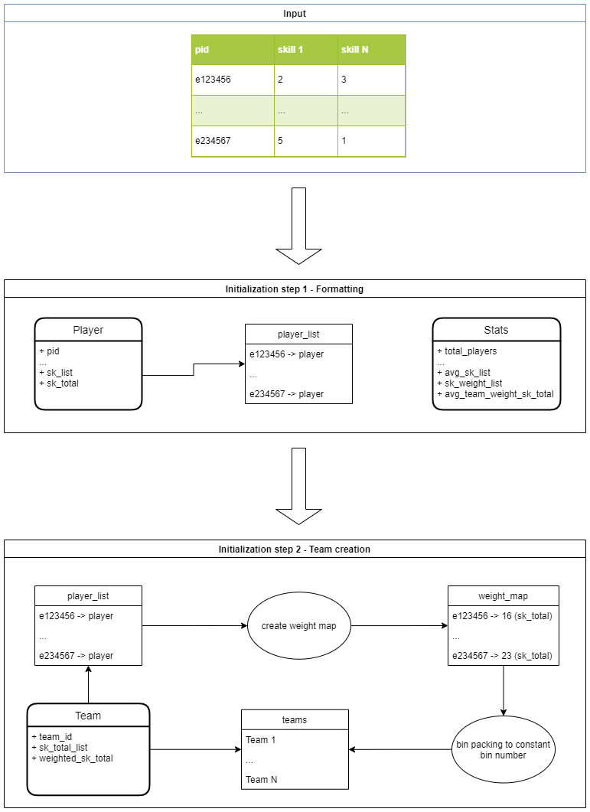
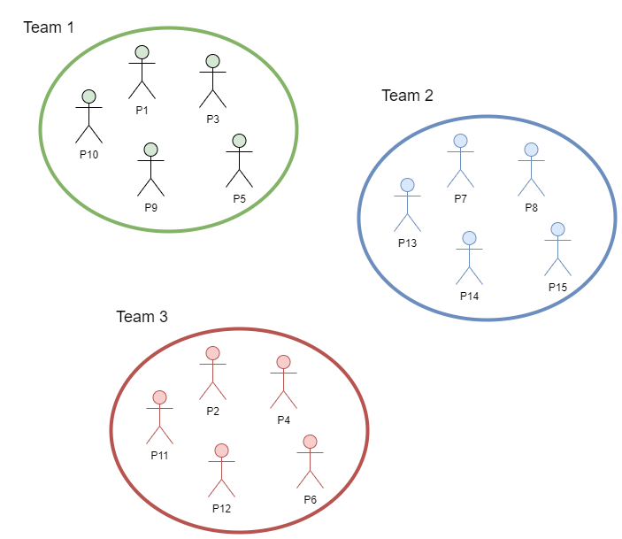
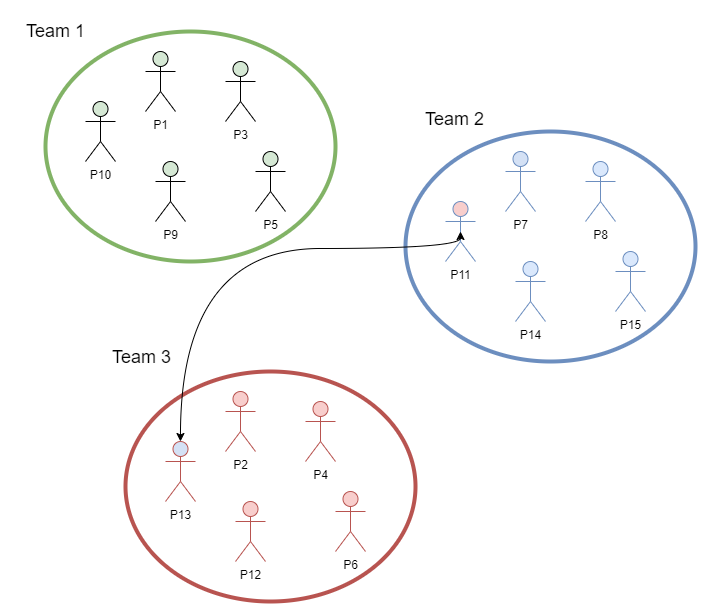
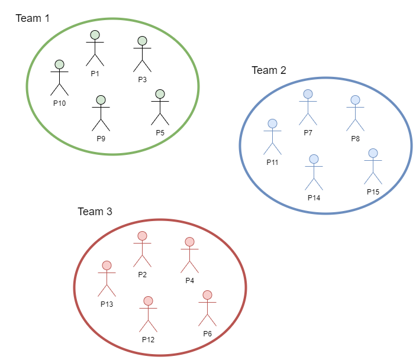

# Balancing Algorithm
## Initialization
1) Use the file provided as input, format must be respected
2) Convert each record into a [Player](../skilled_team/player.py) then compile the [Stats](../skilled_team/stats.py)
3) Generate a weight map (mapping pid to sk_total) and uses it as input to the [bin packing](https://pypi.org/project/binpacking/)
's to_constant_bin_number method, which returns a set of teams balanced using the sk_total value. We then use that set to 
   create a list of [Team](../skilled_team/team.py)
   

## Balancing the teams
### Considering the following teams and stats

|team_id|sk_total_list|weighted_sk_total|
| --- | --- | --- |
|1|[12, 17, 19, 11, 16, 15]|277|
|2|[16, 15, 10, 13, 15, 20]|267|
|3|[12, 17, 12, 17, 15, 15]|270|

Team 1:

|pid|sk_list|sk_total|
| --- | --- | --- |
|1|[4, 4, 5, 3, 5, 5]|26|
|3|[4, 3, 1, 3, 3, 4]|18|
|5|[1, 3, 4, 3, 5, 1]|17|
|9|[1, 5, 5, 1, 2, 2]|16|
|10|[2, 2, 4, 1, 1, 3]|13|

Team 2:

|pid|sk_list|sk_total|
| --- | --- | --- |
|7|[5, 5, 2, 4, 1, 5]|22|
|8|[5, 3, 4, 1, 3, 2]|18|
|13|[3, 3, 2, 2, 3, 5]|18|
|14|[1, 3, 1, 3, 4, 5]|17|
|15|[2, 1, 1, 3, 4, 3]|14|

Team 3:

|pid|sk_list|sk_total|
| --- | --- | --- |
|2|[4, 2, 4, 3, 5, 1]|19|
|4|[3, 4, 1, 2, 5, 4]|19|
|6|[2, 5, 2, 3, 1, 5]|18|
|11|[1, 5, 4, 4, 1, 2]|17|
|12|[2, 1, 1, 5, 3, 3]|15|

Stats:

|total_players|avg_sk_list|sk_weight_list|avg_team_wighted_sk_total|
| --- | --- | --- | --- |
|15|[13.333333333333334, 16.333333333333332, 13.666666666666666, 13.666666666666666, 15.333333333333334, 16.666666666666668]|[5, 2, 4, 4, 3, 1]|271.3333333333333|

### Swapping players
2 random players are selected from 2 random teams. The players are swapped then the teams' stats are recalculated.

Swapping player 13 from team 2 and player 11 from team 3:

Team 2:

|pid|sk_list|sk_total|
| --- | --- | --- |
|7|[5, 5, 2, 4, 1, 5]|22|
|8|[5, 3, 4, 1, 3, 2]|18|
|-> 11|[1, 5, 4, 4, 1, 2]|17|
|14|[1, 3, 1, 3, 4, 5]|17|
|15|[2, 1, 1, 3, 4, 3]|14|

Team 3:

|pid|sk_list|sk_total|
| --- | --- | --- |
|2|[4, 2, 4, 3, 5, 1]|19|
|4|[3, 4, 1, 2, 5, 4]|19|
|6|[2, 5, 2, 3, 1, 5]|18|
|12|[2, 1, 1, 5, 3, 3]|15|
|->13|[3, 3, 2, 2, 3, 5]|18|

Updated stats:

|team_id|sk_total_list|weighted_sk_total|
| --- | --- | --- |
|1|[12, 17, 19, 11, 16, 15]|277|
|->2|[14, 17, 12, 15, 13, 17]|268|
|->3|[14, 15, 10, 15, 17, 18]|269|

Validation:
> Note: for this example, one side validation is enabled

1) weighted_sk_total:

The avg weighted total across all teams is 271.3333333333333. In this example we can see that the weighted total improved, this it's value got closer than the avg value. However, the values for the second team has degraded. But since one side validation is enabled this swap is considered successful.
> If one side validation was disabled, both team's weighted_sk_total must improve
   
2) sk_total_list and min_val_sk_set_size:

Since one side validation is enabled, we only need to make sure that team 2 pass the validation. If we compare the new sk_list to the avg_sk_list 
   
   * Old : [16, 15, 10, 13, 15, 20]
   * New : [14, 17, 12, 15, 13, 17]
   * Avg : [13.333333333333334, 16.333333333333332, 13.666666666666666, 13.666666666666666, 15.333333333333334, 16.666666666666668]
   
We can see that 3 skills improved, and the min_val_sk_set_size = 3 dictate that at least 3 skills must improve to pass the second step of validation.

3) The swap is successful
The swap is now considered completed
   

   
### Iterate
To complete this process we will repeat the same operation until the sum of consecutive failures reaches max_failures (here 1000). The amount of successful swap is then returned in the stats.

Stats:
   * total_players: 15
   * total_teams: 3
   * avg_sk_list: [13.333333333333334, 16.333333333333332, 13.666666666666666, 13.666666666666666, 15.333333333333334, 16.666666666666668] 
   * sk_weight_list: [5, 2, 4, 4, 3, 1]
   * players_per_team: 5 
   * min_val_sk_set_size: 3
   * one_side_validation: True 
   * successful_swaps: 5 
   * avg_team_weighted_sk_total: 271.3333333333333

Teams:

|team_id|sk_total_list|weighted_sk_total|player_list
| --- | --- | --- | --- |
|1|[13, 15, 16, 13, 14, 17]|270|[P1, P3, P9, P12, P10]|
|2|[14, 17, 12, 15, 13, 17]|268|[P11, P15, P8, P14, P7]|
|3|[13, 17, 13, 13, 19, 16]|276|[P13, P5, P4, P6, P2]|

